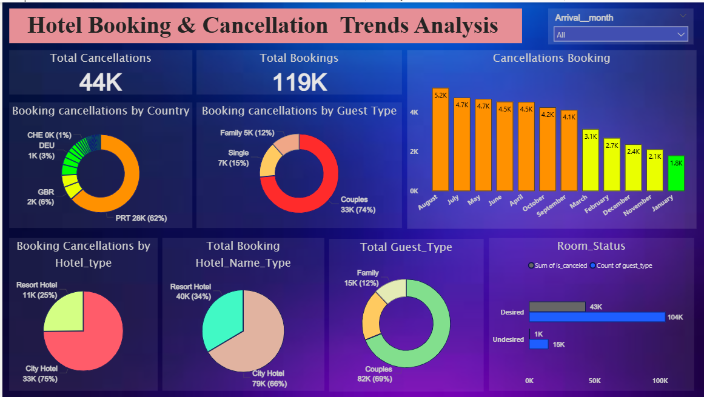

# 🏨 — Hotel Booking Cancellation Analysis  

✨ My second data analytics project, focused on exploring hotel booking cancellations, identifying patterns, and sharing insights to help reduce cancellations and improve business decisions 🚀  

---

## 📌 Project Overview  

This project was part of my **data analytics learning journey**.  
I worked with hotel booking data using both **Excel** and **Power BI** to practice end-to-end analysis:  

- 🧹 Cleaning & transforming raw data (Excel & Power Query)  
- 🔗 Building data models and relationships  
- 🎨 Designing dashboards in Power BI  
- 💡 Extracting insights on booking behavior & cancellations  

---

## 🔍 Key Business Questions  

1️⃣ What percentage of bookings get **cancelled**?  
2️⃣ Do cancellations vary by **hotel type, season, or country**?  
3️⃣ How do **lead time** and **deposit type** impact cancellations?  
4️⃣ Are there noticeable **monthly/seasonal trends**?  
5️⃣ What recommendations can help hotels **reduce cancellations**?  

---

## 🚀 Tools & Technologies Used  

- 🧮 **Microsoft Excel** (data cleaning, pivot tables, EDA)  
- 📊 **Power BI Desktop** (data modeling, DAX, dashboards)  
- 📂 **CSV dataset** (hotel bookings)  
- 🖥️ **Git & GitHub** (version control, project publishing)  

---

## 📊 Visuals & Dashboards  

The project includes:  

- 📌 **KPI Cards**: Total Bookings, Cancellations, Cancellation Rate  
- 📈 **Monthly/Seasonal Trends** of cancellations  
- 🏨 **Hotel-wise Comparison** (City vs Resort Hotels)  
- 🌍 **Geographic Insights** (cancellations by customer origin)  
- 🔎 **Key Drivers** (lead time, deposit type, etc.)

📸 **Sample Screenshot:**  
👉     

---

## 🧠 Insights & Recommendations  

- Bookings with **longer lead times** are more likely to get cancelled ⏳  
- **No-deposit bookings** have a higher cancellation rate 💳  
- Cancellations show **seasonal peaks** during certain months 📅  
- ✅ **Recommendation**: Ask for partial deposits, review policies for long lead times, and prepare resources for peak seasons  

---

## 📈 Key Learnings  

- 🧹 Practiced **data cleaning and analysis** in Excel  
- 📊 Built **KPIs and dashboards** in Power BI  
- 🏨 Understood how **cancellations affect hotel performance**  
- 🎨 Improved skills in **data storytelling with visuals**  

---

## 🌟 Future Improvements  

- 💰 Add an analysis of the **revenue impact** of cancellations  
- 👥 Study cancellations by **customer demographics**  
- ☁️ Publish the dashboard to **Power BI Service** for easy access  
- 🔄 Set up **automated data refresh** for live updates  

---

## ▶️ How to Use  

1. ⬇️ Download this repository (or clone with Git)  
2. 📂 Open the `.xlsx` file in **Excel** for raw data analysis  
3. 🖥 Open the `.pbix` file in **Power BI Desktop**  
4. 🔄 Click **Refresh** to update the dashboard with data  

---

## 📄 License  

📌 This project is for **learning purposes only**.  
📊 Data is **sample hotel booking data** (non-confidential).  
🙌 Feel free to explore, learn, and get inspired 🚀  

